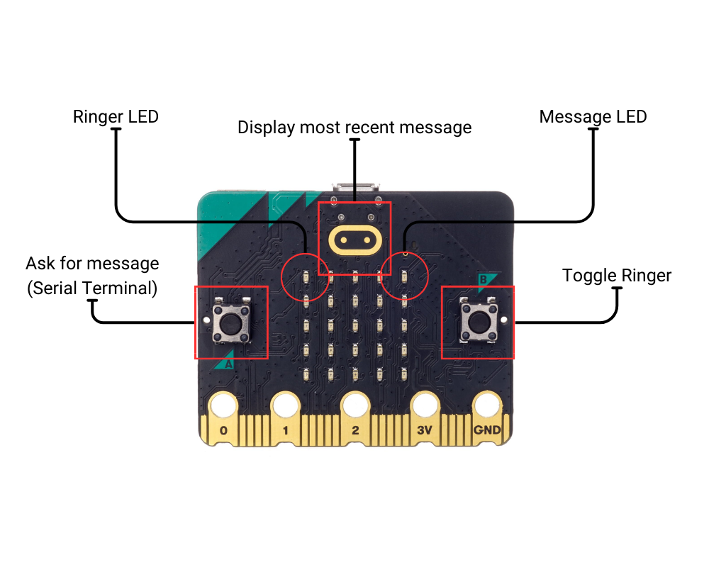

# bbc-microbit-pager
A simple pager system for the BBC Microbit

Flash the "main.py" code to your pagers using [Python Microbit Flasher](https://python.microbit.org), requires the V2 Board

## Usage:

| Button | Function |
| :-----------: | ------------------------------------------ |
| Button A | Asks for input from Serial Terminal, then sends |
| Button B | Toggles Ringer |
| Gold Button | Displays most recent message |

</img>
